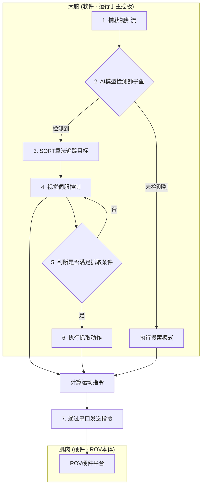

# FLL 2025 创新项目：狮子鱼AI识别与自动抓取水下机器人

  

## 1. 项目简介

欢迎来到我们的 FIRST LEGO League (FLL) 2025 赛季创新研究项目！本项目旨在解决入侵物种——狮子鱼，对海洋生态系统造成的严重威胁。我们设计并实现了一个**基于人工智能视觉的水下机器人（ROV）**，它能够**自动识别、追踪并抓取**狮子鱼。

本项目完全开源，旨在为对机器人、人工智能和海洋保护感兴趣的学生、教育者和创客们提供一个实践性的学习平台。

## 2. 问题背景

狮子鱼是一种极具破坏性的入侵物种，它们在北大西洋、加勒比海和地中海地区迅速繁殖，吞噬本地鱼类，严重破坏了珊瑚礁生态系统的平衡。由于它们繁殖能力强、天敌稀少且有毒刺保护，人工清除成本高昂且效率低下。因此，开发一种自动化、低成本的解决方案对于控制其种群至关重要。

## 3. 我们的解决方案

我们提出了一套集“大脑”、“眼睛”和“肌肉”于一体的智能水下机器人系统。它通过摄像头实时感知水下环境，利用AI模型锁定狮子鱼，并通过一套闭环控制算法精确地移动并执行抓取任务。

### 系统工作流程

整个系统的工作流程可以概括为以下几个步骤：



### 核心技术栈

*   **硬件平台**:
    *   **主控单元**: 搭载NPU的嵌入式AI开发板（如华为Atlas 200I DK A2等）。
    *   **感知**: USB摄像头。
    *   **执行机构**: ROV机架、推进器、电机驱动模块、机械夹爪和舵机。
    *   **通信**: TTL串口模块，用于主控板与下位机（如Arduino, Pico）通信。

*   **软件与算法**:
    1.  **实时检测 (`lionfish.py`)**: 使用轻量化的 **YOLOv8** 模型，经过训练后能够快速、准确地识别出视频流中的狮子鱼。
    2.  **目标追踪 (`lionfish.py`)**: 采用 **SORT (Simple Online and Realtime Tracking)** 算法。该算法结合了**卡尔曼滤波器**进行运动状态预测和**匈牙利算法**进行数据关联，确保了即使在检测器短暂失效或目标部分遮挡时，也能稳定地追踪同一个目标。
    3.  **视觉伺服控制 (`lionfish.py`)**: 这是实现“自动”抓取的关键。
        *   **对准控制**: 在画面中设定一个虚拟的“抓取点”（例如，画面中心偏下方）。通过计算目标中心与抓取点的像素误差，使用**P控制器**（比例控制器）生成ROV的**偏航(Yaw)**和**升降(Heave)**指令，使机器人自动对准目标。
        *   **距离控制**: 通过计算目标边界框在画面中的**面积占比**来估算距离。当面积小于设定值时，机器人前进；大于设定值时，则后退，直到距离恰好适合抓取。
    4.  **机器人控制API (`rov_api.py`)**: 我们创建了一个硬件抽象层。它将上层算法生成的高级指令（如`forward: 0.8`, `yaw: -0.5`）转换为底层电机所需的具体PWM信号值，并处理了电机反向、增益调整等细节，大大提高了代码的可读性和可移植性。

## 4. 仓库文件结构

```
.
├── lionfish.py                   # 启动程序，包含检测、追踪和控制的主逻辑
├── rov_api.py                # ROV硬件控制API，用于运动解算
├── lionfishdet_utils.py      # AI模型推理的辅助工具（图像预处理、NMS等）
├── lionfish.om               # 转换好的昇腾离线AI模型
├── class_names.txt           # 模型识别的类别名称
└── README.md                 # 本说明文件
```

## 5. 如何使用

### 依赖环境

*   **硬件**: 准备好上文提到的ROV硬件平台。
*   **软件**:
    *   Python (3.8或更高版本)
    *   华为昇腾 `ais_bench` 推理库 (如果使用昇腾平台)
    *   安装所需的Python库:
        ```bash
        pip install opencv-python numpy pyserial scipy torch torchvision
        ```

### 配置

在 `lionfish.py` 文件的开头，根据你的实际情况修改以下常量：

```python
# --- 全局配置常量 ---
ENABLE_GUI = True  # 在PC上调试时设为True，在无屏幕的机器人上设为False
SERIAL_PORT = '/dev/ttyUSB0'  # 修改为你的串口设备号
BAUD_RATE = 115200

# --- 自动抓取逻辑的配置参数 ---
DESIRED_AREA_RATIO = 0.03  # 期望目标面积占比，需要反复调试以找到最佳值
AREA_TOLERANCE = 0.04      # 面积容忍度
GRAB_TARGET_POINT = (0.5, 0.6) # 抓取对准点在画面的归一化坐标 (x, y)
GRAB_TOLERANCE = 0.05      # 对准容忍度

# --- 机器人硬件配置 ---
# 根据你的ROV电机安装方向，决定是否需要反转输出
ROBOT_INVERTS = {
    'pitch_mid': False, 'vert_left': True, 'vert_right': False,
    'yaw_left': True, 'yaw_right': False, 'arm_extend': True,
    'arm_pitch': False, 'gripper': False
}
# 调整各运动方向的灵敏度
ROBOT_GAINS = {
    'FORWARD_GAIN': 1.0, 'HEAVE_GAIN': 0.9, 'YAW_GAIN': 1.2,
    'BODY_PITCH_GAIN': 1.0, 'ROLL_GAIN': 1.0
}
```

### 运行

1.  确保所有硬件连接正确，ROV已通电。
2.  在终端中运行主程序：
    ```bash
    python lionfish.py
    ```
3.  程序启动后，将通过摄像头寻找狮子鱼。一旦锁定目标，ROV将开始自动对准和接近。当满足抓取条件时，`grab_action` 信号将被触发。

## 6. 深入理解：为了更好的学习

### 为什么追踪比只检测更重要？

*   **稳定性**: 单纯的检测器在每一帧都可能给出稍有不同的边界框，导致机器人控制指令频繁抖动。卡尔曼滤波器可以平滑这些抖动，提供一个更稳定的目标位置。
*   **身份保持**: 在有多个目标或短暂遮挡时，追踪算法可以确保我们始终锁定的是同一个目标，避免了目标丢失或切换。

### 什么是运动混合？

在 `rov_api.py` 中，`_calculate_motion_speeds` 函数执行了运动混合。它的作用是将简单的运动指令（如“前进”和“左转”）分解并“混合”成每个独立推进器应该输出的推力。这个算法的设计完全取决于你的ROV上有几个推进器以及它们安装的角度和位置。

## 7. 未来展望与改进方向

这个项目是一个很好的起点，你可以在此基础上进行扩展：

*   **高级控制器**: 使用 **PID控制器** 代替P控制器，以获得更平滑、更精确的控制效果，消除稳态误差。
*   **多传感器融合**: 集成深度传感器或声纳，以获得更精确的距离信息，而不是仅仅依赖视觉面积估算。
*   **自主搜索**: 开发一套自主搜索算法，让ROV在没有发现目标时，能按预定路径（如“之”字形）进行巡航。
*   **模型优化**: 在更多样化的水下环境中收集数据，重新训练模型，以提高其在不同光照、水质下的鲁棒性。

## 8. 贡献与致谢

欢迎所有对本项目感兴趣的同学和老师们提出改进建议、修复Bug或贡献新的功能！你可以通过提交 Pull Request 的方式参与进来。

感谢 **FIRST (For Inspiration and Recognition of Science and Technology)** 组织为我们提供了这样一个充满挑战与乐趣的平台，激励我们用科技解决现实世界的问题。

---
**祝 FLL 2025 赛季好运！**